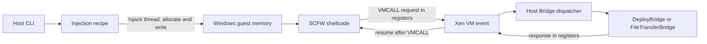
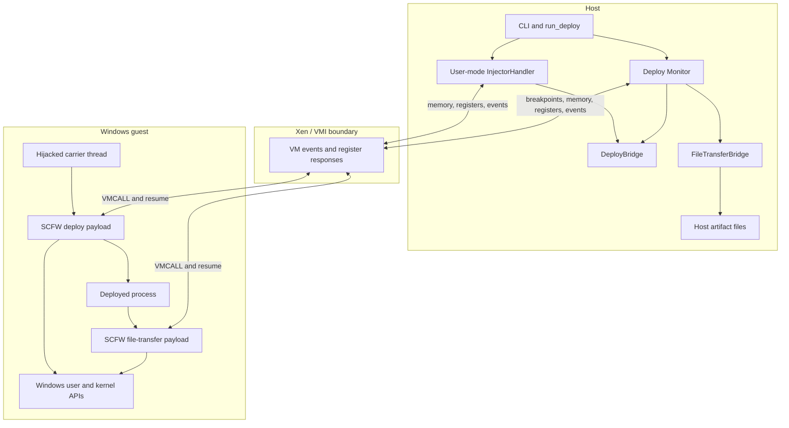

# Windows bridge: architecture and workflow

## The short version

`windows-bridge` lets a Rust program on the **host** run a small SCFW payload inside a Windows **guest** without installing a guest agent.

The host temporarily hijacks a guest thread to allocate and start the payload. The payload performs Windows work, then uses `VMCALL` as a synchronous request/response boundary. Xen turns that instruction into a VM event; the Rust bridge decodes the guest registers, runs the matching host handler, writes a response into the registers, and resumes the guest.



There is no socket, shared filesystem, or long-running service in the guest. Registers carry control messages; VMI reads and writes guest memory when a request needs bulk data.

## Vocabulary

| Name | Meaning here |
|---|---|
| **SCFW** | The C++ shellcode framework and the payloads built with it. It supplies position-independent startup/import resolution and the guest side of the bridge transport. |
| **Guest** | The Windows VM. The deploy payload runs in user mode; the file-transfer payload runs in kernel mode on an intercepted guest thread. |
| **Host** | The Rust `windows-bridge` process. It controls Xen through VMI, injects payloads, handles bridge requests, and writes transferred artifacts. |
| **Recipe** | A host-side sequence of guest calls and register changes. It advances only when the hijacked thread reaches the expected return point. |
| **Bridge** | The register protocol plus the Rust dispatcher and request-specific handler. `DeployBridge` and `FileTransferBridge` are handlers, not transports. |
| **Monitor** | The second host event loop used by monitored deploys. It installs kernel breakpoints, tracks the launched process, and owns both bridge handlers. |

## Layers and ownership



The host controls execution but does not call Windows APIs itself. Recipes arrange a guest call frame; Windows executes the call. Conversely, the guest never opens a host file directly. It exposes a buffer address, and the host reads that guest memory through VMI.

## Common lifecycle

### 1. Build-time: payload becomes part of the host binary

SCFW builds each x64 payload as a flat `.bin`. Rust embeds it with `include_bytes!`. No payload file is fetched at runtime.

### 2. Startup: establish Windows and Xen context

`main`:

1. opens the Xen domain selected by `VMI_XEN_DOMAIN`;
2. pauses the VM briefly to find the Windows kernel;
3. loads the matching kernel profile, including structure offsets and symbols;
4. creates a `VmiSession` and finds the configured carrier process, normally `explorer.exe`.

The kernel profile is also required later by the monitor to place kernel breakpoints.

### 3. Injection: borrow a guest thread

For deploy, `InjectorHandler<UserMode>` watches the target process until it finds a viable user-mode return point. It removes execute permission in a private Xen view so that the returning thread traps. At that trap, the recipe owns the thread registers long enough to run this call chain:

```text
user_shellcode_recipe
├─ VirtualAlloc(RWX, page-aligned payload size)
├─ retry if allocation fails
├─ RtlFillMemory(payload bytes)    # materialize demand-zero pages
├─ VMI write(shellcode + parameters)
├─ on write failure: VirtualFree + retry
├─ CreateThread(shellcode, parameter)
├─ on creation failure: VirtualFree + retry
└─ CloseHandle(created thread handle)
```

`user_shellcode_recipe` accepts either an encoded `ShellcodeParameters` block by reference or a `ShellcodeParameterValue`. An encoded block is appended to the payload and its guest address becomes `lpParameter`; a `ShellcodeParameterValue` appends no data and is passed through unchanged. The single parameter-source argument makes these modes mutually exclusive. After `CreateThread` succeeds, the self-cleaning shellcode owns and releases its allocation.

After the recipe restores the carrier thread's original registers, the injector tears down its private view and enables hypercall monitoring. The newly created guest thread runs independently.

### 4. Bridge exchange: route one register packet

The guest transport builds:

```text
magic = "VMIB"
request = handler id
method = operation within that handler
value1..value4 = operation-specific values
```

On x64 Xen, a request uses `RCX` for the magic, `RDX` for `request | method << 16`, and `R8`-`R11` for the four values. The host response uses `RAX`, `RBX`, `RCX`, and `RDX`.

For every handled hypercall, the host:

1. advances guest `RIP` past `VMCALL`;
2. decodes the registers into a `BridgePacket`;
3. matches `magic`, then `request`;
4. calls the handler selected by `request` and the operation selected by `method`;
5. stamps `"VMI-RS3!"` and `"VMI-RS4!"` into response slots 3 and 4;
6. writes the response registers and resumes the vCPU.

The SCFW client accepts a response only when both verification stamps match. A missing or unrelated host handler therefore looks like “no response,” not a valid policy decision.

| Request | Handler | Methods |
|---:|---|---|
| `0x0001` | `DeployBridge` | download gate, execute gate, terminal result |
| `0x0003` | `FileTransferBridge` | begin, set buffer, chunk, close, terminal result |

Handlers may return a typed completion result in addition to register values. The injector uses that result to end its event loop. The deploy monitor deliberately keeps running: it writes bridge responses but completes only when the tracked process is cleaned up or monitoring is cancelled.

### 5. Terminal status

Both payloads report a compact status in `value1` and a native Windows error in `value2`:

```text
value1 bits  0..7   stage
             8..15  stable status
            16..23  stage-specific error code
value2               NTSTATUS / HRESULT / native code
```

Stable statuses are success, waiting, invalid parameters, operation failed, and aborted. Keeping the stage separate answers both “what failed?” and “how did it fail?”

## The monitored-deploy handoff

Monitoring must be installed **before** execution is allowed, or a short-lived child could start and exit before its creation hook exists. The execute gate provides that synchronization point.


Without `--monitor`, the first `DeployBridge` answers the execute gate directly and waits for the payload's terminal result. With `--monitor`, it returns `WAIT`; a new `DeployBridge` inside `Monitor` answers the repeated gate with `CONTINUE`.

## Call graph

```text
main
└─ run_deploy
   ├─ DeployArguments::into_request
   │  ├─ DeployParameters builder
   │  └─ DeployPolicy
   ├─ find_process_id
   ├─ VmiSession::handle(User InjectorHandler)
   │  ├─ deploy_recipe
   │  │  └─ user_shellcode_recipe
   │  └─ DeployBridge::handle
   └─ if monitored: VmiSession::handle(Monitor)
      ├─ kernel hook dispatch
      └─ Bridge<(DeployBridge, FileTransferBridge)>::dispatch
```

Inside the guest:

```text
SCFW deploy entry
└─ wait_for_host
   └─ parse parameters → initialize COM/paths
      └─ download? → extract? → execute?
         └─ terminal bridge result
```

## What to read next

- [Deploy workflow](deploy/README.md): parameter encoding, policy gates, stage order, and monitor handoff.
- [File-transfer workflow](file_transfer/README.md): kernel hooks, synchronous injection, chunk movement, and host output rules.
