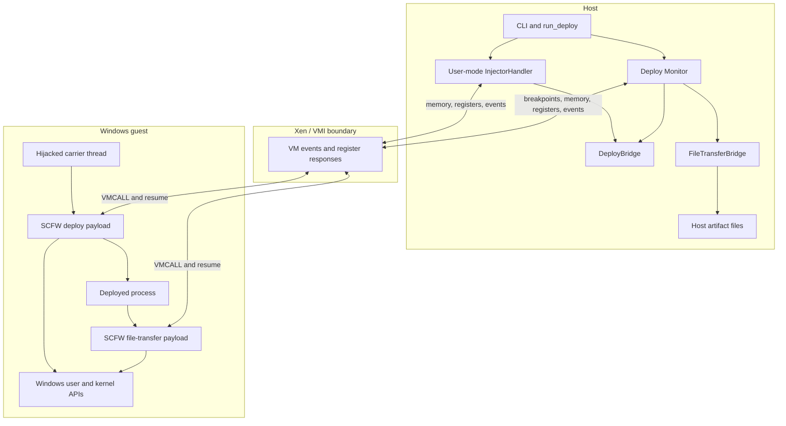
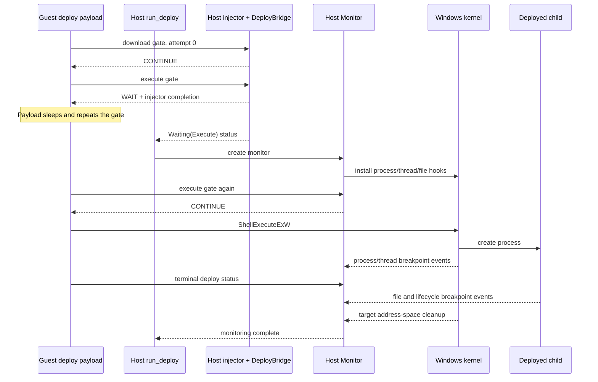

# Windows bridge: deployment, monitoring and file transfer

## The short version

`windows-bridge` composes the shellcode primitives into a supervised workflow: the host deploys content into a Windows **guest**, gates every stage from outside the VM, then watches the process it launched and pulls the files it writes back to the host.

It assumes the injection and bridge mechanics documented in [`windows-shellcode`](../windows-shellcode/README.md) - payload embedding, thread hijacking, the `VMCALL` register protocol, the verification stamps, the request id registry and the terminal status encoding. This document covers only what is built on top of them. `windows-bridge` uses requests `0x0011` (`DeployBridge`) and `0x0012` (`FileTransferBridge`).

```mermaid
flowchart LR
    CLI[Host CLI] --> Recipe[Deploy recipe]
    Recipe -->|hijack thread; spawn payload| Deploy[SCFW deploy payload]
    Deploy -->|download, extract, execute gates| DB[DeployBridge]
    DB -->|park at execute gate| Monitor[Host Monitor]
    Monitor -->|kernel breakpoints| Child[Deployed process]
    Child -->|NtWriteFile / NtClose| Transfer[SCFW file-transfer payload]
    Transfer --> FB[FileTransferBridge]
    FB --> Output[Host artifact files]
```



The two payloads differ in how they are started: deploy is spawned on its own guest thread and outlives the recipe, while file transfer is called synchronously on the closing thread inside an `NtClose` hook.

## Vocabulary

Terms specific to this example; the shared ones are defined in [`windows-shellcode`](../windows-shellcode/README.md#vocabulary).

| Name | Meaning here |
|---|---|
| **Guest** | The Windows VM. The deploy payload runs in user mode on its own thread; the file-transfer payload runs in kernel mode on an intercepted guest thread. |
| **Host** | The Rust `windows-bridge` process. It controls Xen through VMI, injects payloads, handles bridge requests, and writes transferred artifacts. |
| **Monitor** | The second host event loop used by monitored deploys. It installs kernel breakpoints, tracks the launched process, and owns both bridge handlers. |
| **Gate** | A bridge method whose response decides whether the payload may proceed to the next stage. The host, not the guest, holds the policy. |

## Layers and ownership



The host controls execution but does not call Windows APIs itself. Recipes arrange a guest call frame; Windows executes the call. Conversely, the guest never opens a host file directly. It exposes a buffer address, and the host reads that guest memory through VMI.

## Deploy lifecycle

### 1. Startup

`main` builds the session through the shared example bootstrap and keeps the kernel profile, which the monitor needs in order to place kernel breakpoints. It also registers `SIGHUP`, `SIGINT`, `SIGALRM` and `SIGTERM` handlers, because monitoring runs until the tracked process is gone and must stay interruptible.

### 2. Injection: spawn the deploy payload

`InjectorHandler<UserMode>` hijacks a thread in the carrier process, normally `explorer.exe`, and runs `user_shellcode_spawn_recipe` with the encoded `DeployParameters` block. Spawning rather than calling is required here: the payload must outlive the recipe so the host can park it at a gate, install monitoring, and only then let it continue.

The recipe, the register protocol and the terminal status encoding are described in [`windows-shellcode`](../windows-shellcode/README.md#lifecycle).

### 3. Gates: host-side policy

`DeployBridge` answers three methods. The download gate reports readiness and permits bounded retries; the execute gate decides whether the payload may launch the program, abort, or park; the terminal method reports the payload's final status. The guest carries no policy of its own - it asks before every irreversible step.

`DeployBridge` completes the injector event loop, while the monitor's copy deliberately does not: it answers gates but keeps running until the tracked process is cleaned up or monitoring is cancelled.

### 4. File transfer: kernel-mode injection from a hook

The monitor's `NtWriteFile` and `NtClose` hooks drive `kernel_shellcode_call_recipe` on the closing thread through its own `RecipeExecutor`, without an injector. Calling rather than spawning is required here too, for the opposite reason: the payload must finish before `NtClose` proceeds, and it operates on a handle that is only valid in the closing process. See [File-transfer workflow](file_transfer/README.md).

## The monitored-deploy handoff

Monitoring must be installed **before** execution is allowed, or a short-lived child could start and exit before its creation hook exists. The execute gate provides that synchronization point.



Without `--monitor`, the first `DeployBridge` answers the execute gate directly and waits for the payload's terminal status. With `--monitor`, it returns `WAIT`; a new `DeployBridge` inside `Monitor` answers the repeated gate with `CONTINUE`.

## Call graph

```text
main
└─ run_deploy
   ├─ DeployArguments::into_request
   │  ├─ DeployParameters builder
   │  └─ DeployPolicy
   ├─ common::find_process_id
   ├─ VmiSession::handle(User InjectorHandler)
   │  ├─ deploy_recipe
   │  │  └─ user_shellcode_spawn_recipe
   │  └─ DeployBridge::handle
   └─ if monitored: VmiSession::handle(Monitor)
      ├─ kernel hook dispatch
      └─ Bridge<(DeployBridge, FileTransferBridge)>::dispatch
```

Inside the guest:

```text
SCFW deploy entry
└─ wait_for_host
   └─ parse parameters → initialize COM/paths
      └─ download? → extract? → execute?
         └─ terminal bridge result
```

## What to read next

- [Shellcode primitives](../windows-shellcode/README.md): payload embedding, the four execution modes, the register protocol, and the status encoding this example builds on.
- [Deploy workflow](deploy/README.md): parameter encoding, policy gates, stage order, and monitor handoff.
- [File-transfer workflow](file_transfer/README.md): kernel hooks, synchronous injection, chunk movement, and host output rules.
