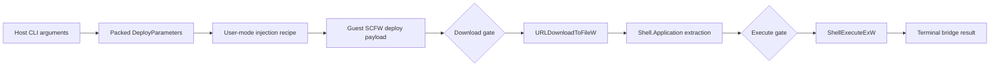
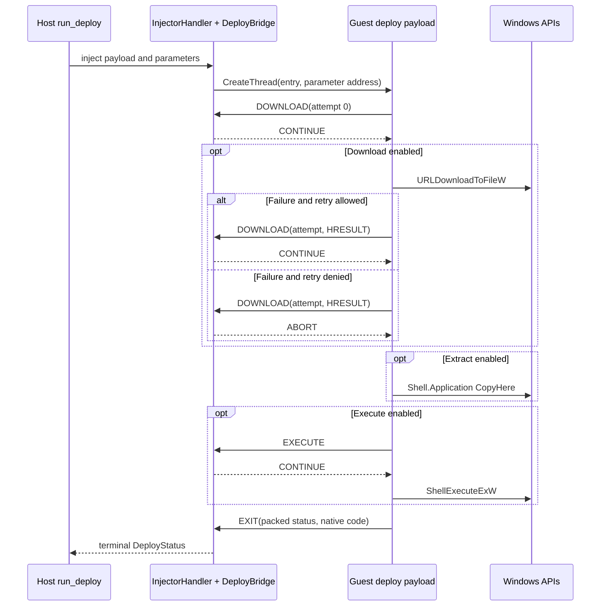
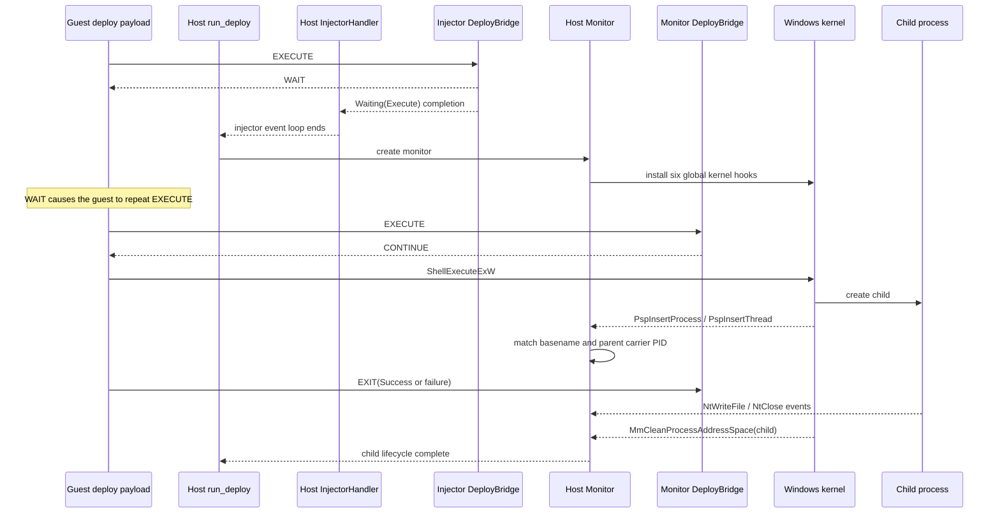

# Deploy bridge

## Purpose

The deploy bridge runs an optional three-stage job inside a Windows guest:

```text
download  →  extract  →  execute
 optional    optional    optional
```

The Rust host serializes the request and injects an embedded user-mode SCFW payload into a carrier process, normally `explorer.exe`. The payload calls Windows APIs in the guest. `DeployBridge` does not perform those operations; it supplies policy decisions at two synchronization gates and receives the terminal status.

With `--monitor`, the execute gate also hands control from the short-lived injector to a kernel-breakpoint monitor **before** the child is allowed to start.



Disabled stages are skipped; the arrows show ordering, not mandatory work.

## Components

| Component | Runs in | Role |
|---|---|---|
| `DeployArguments::into_request` | Host | Converts CLI options into typed parameters, host policy, and optional monitor configuration. |
| `DeployParameters` | Host | Encodes the exact sequential buffer consumed by the payload. |
| `deploy_recipe` / `shellcode_recipe` | Host controlling guest | Allocates guest memory, copies payload plus parameters, and starts a guest thread. |
| SCFW deploy payload | Guest user mode | Parses parameters, resolves imports, expands paths, and calls download/extract/execute APIs. |
| `DeployBridge` | Host | Answers download and execute gates and decodes terminal results. |
| `Monitor` | Host | For monitored execution, installs kernel hooks, allows the parked execute gate, tracks the child, and runs file transfer. |

## End-to-end workflow

### 1. Build the request

The CLI supports four useful shapes:

| Request | Enabled stages |
|---|---|
| no URL, no executable | no-op payload, useful as a bridge/injection check |
| URL + download path | download, with optional extraction |
| executable | execute only |
| URL + download path + executable | download, optional extraction, then execute |

The typed builder prevents incomplete host-side combinations such as a URL without a destination path. CLI constraints require execute-only fields (`arguments`, working directory, show-window value, monitoring) to have an executable.

### 2. Encode shellcode and parameters

Rust builds one guest allocation:

```text
+------------------------+  allocation base / thread start
| SCFW deploy shellcode  |
+------------------------+
| alignment padding      |
+------------------------+  parameter address / thread argument
| uint32 flags           |
| enabled UTF-16 fields  |
| optional int32         |
+------------------------+
| page padding           |
+------------------------+
```

All integers are little-endian. Strings are NUL-terminated UTF-16LE and have no length prefixes. Fields appear only when their flag is set:

```text
uint32 flags
if download:          url, download_path
if extract:           extraction_directory
if execute:           executable_path
if arguments:         arguments
if working_directory: working_directory
if show_window:       int32 show_window
```

The payload parser validates flag relationships but trusts the buffer's bounds and string termination. The host must keep the correctly encoded allocation alive until the payload returns.

### 3. Inject into the carrier process

`InjectorHandler<UserMode>` finds a viable thread in the configured process and temporarily traps its next user-mode instruction. The shared recipe then runs guest calls on that hijacked thread:

```text
VirtualAlloc(shellcode + parameters, RWX)
→ RtlFillMemory(allocation)
→ host VMI-write(payload)
→ CreateThread(shellcode start, parameter address)
→ CloseHandle(thread handle)
→ restore carrier-thread registers
```

The new guest thread owns the deploy payload. After recipe teardown, the injector switches from thread-hijack events to bridge hypercalls.

### 4. Rendezvous at the initial download gate

The payload's first action is `DOWNLOAD(attempt=0)`, even when no download stage is enabled. This is a readiness handshake: until a matching host handler stamps a valid response, the payload sleeps for 250 ms and retries.

`DeployBridge` always returns `CONTINUE` for attempt zero. The payload then parses parameters, expands configured paths, initializes COM, and enters the enabled stages.

### 5. Run stages and consult host policy

```mermaid
stateDiagram-v2
    [*] --> HostGate
    HostGate --> Parameters: CONTINUE
    HostGate --> Aborted: ABORT
    Parameters --> Initialization: flags valid
    Parameters --> Failed: invalid flags
    Initialization --> Download: download enabled
    Initialization --> ExecuteGate: execute only
    Initialization --> Success: no operation
    Download --> Download: failed and retry allowed
    Download --> Extract: success and extract enabled
    Download --> ExecuteGate: success and execute enabled
    Download --> Success: success; no later stage
    Download --> Failed: failure and retry denied
    Extract --> ExecuteGate: success and execute enabled
    Extract --> Success: success; no execute
    Extract --> Failed: extraction error
    ExecuteGate --> Execute: CONTINUE
    ExecuteGate --> ExecuteGate: WAIT
    ExecuteGate --> Aborted: ABORT
    Execute --> Success: ShellExecuteExW succeeds
    Execute --> Failed: ShellExecuteExW fails
```



#### Download policy

On a failed `URLDownloadToFileW`, the payload sends the one-based attempt number and HRESULT. The host allows another attempt while:

```text
attempt <= max_download_retries
```

Therefore `--max-download-retries 0` aborts after the first failure, while `2` permits retries after failures 1 and 2 and aborts after failure 3. The initial attempt-zero readiness gate does not consume retry budget.

#### Execute policy

| Host response | Guest behavior | Injector behavior |
|---|---|---|
| `CONTINUE` | Call `ShellExecuteExW`. | Keep waiting for terminal `EXIT`. |
| `ABORT` | Return terminal `Aborted(Execute)`. | Complete when `EXIT` arrives. |
| `WAIT` | Sleep 250 ms and repeat the same gate. | Return a synthetic `Waiting(Execute)` result immediately, allowing the host to replace the injector with `Monitor`. |

### 6. Return terminal status

The payload sends method `EXIT` with:

```text
value1 = stage | status << 8 | error_code << 16
value2 = native Windows error (NTSTATUS, HRESULT, or Win32 code)
```

`DeployBridge` logs all four pieces. In an unmonitored run, it attaches `value1` as the injector completion result; `run_deploy` accepts only stable status `Success`.

## Unmonitored sequence



## Monitored handoff

The monitor must see process creation, so the first bridge is intentionally configured with `ExecuteResponse::Wait`.



`Monitor::new` installs breakpoints for:

- `PspInsertProcess` and `PspInsertThread`;
- `KeTerminateThread` and `MmCleanProcessAddressSpace`;
- `NtWriteFile` and `NtClose`.

It then owns a tuple bridge:

```text
Bridge<(DeployBridge allow_execute, FileTransferBridge)>
```

The next repeated execute request is routed to the monitor's `DeployBridge` and receives `CONTINUE`. Process creation is matched by the executable basename plus the original carrier PID as parent; comparison accepts the kernel's truncated image name.

The deploy payload's later `EXIT` is decoded and answered, but it does not end the monitor. Normal monitor completion is the target process's address-space cleanup. This keeps monitoring and file transfer alive for the full child lifetime.

## Guest stage details

### Download

- Expands environment variables in the destination path, not in the URL.
- Creates the destination's parent directory.
- Uses `URLDownloadToFileW`.
- Reports each failed attempt to the host before deciding whether to retry.

### Extract

- Requires download.
- Expands and creates the extraction directory.
- Uses `Shell.Application`/`IShellDispatch` to open the archive and output folder.
- Calls `CopyHere` with silent/no-confirmation flags.
- Polls output item count every 100 ms, for at most 600 checks, to approximate completion.

### Execute

- Expands environment variables in the executable and explicit working-directory paths.
- Defaults the working directory to the executable's parent; if no parent exists, leaves it to Windows.
- Defaults `nShow` to `SW_SHOWNORMAL`.
- Waits at the host execute gate, then calls `ShellExecuteExW`.
- Treats successful process creation as deploy success; child exit status is not part of the payload result.

## Call graphs

Host:

```text
run_deploy
├─ DeployArguments::into_request
│  ├─ DeployParametersBuilder::build
│  └─ DeployPolicy
├─ find_process_id(carrier)
├─ VmiSession::handle
│  └─ InjectorHandler<UserMode, DeployBridge>
│     ├─ deploy_recipe
│     │  └─ shellcode_recipe
│     └─ DeployBridge::handle
└─ if --monitor
   └─ VmiSession::handle
      └─ Monitor
         ├─ kernel breakpoint hooks
         └─ Bridge<(DeployBridge, FileTransferBridge)>
```

Guest:

```text
entry(parameter address)
└─ Deploy
   ├─ bridge.wait_for_host
   ├─ parse_parameters
   └─ DeployInternal
      ├─ expand paths
      ├─ CoInitializeEx
      ├─ Download?
      ├─ Extract?
      ├─ bridge.wait_for_execute + Execute?
      ├─ CoUninitialize
      └─ bridge.exit(result)
```

## Important boundaries

- x64 Windows on Xen is assumed by the payload build, injector, and VMCALL transport.
- Paths are expanded into fixed `MAX_PATH` buffers; longer expansions fail initialization.
- The payload parser has no buffer length and does not validate string contents. Safety depends on the host encoder.
- Extraction completion is inferred from item counts, not a completion event.
- In monitor mode, completion is child cleanup or external cancellation. A launch failure before a matching child appears does not currently set monitor completion from the deploy `EXIT` packet.

See the [generic architecture](../README.md) for the bridge ABI and the [file-transfer workflow](../file_transfer/README.md) for the monitor's artifact path.
