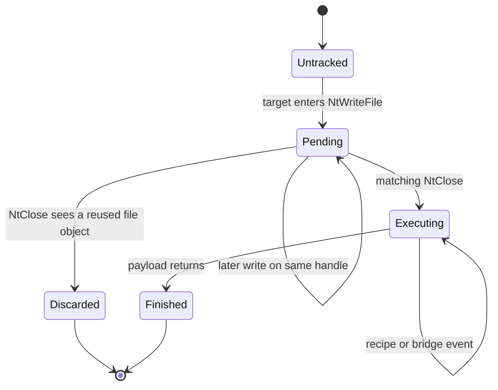
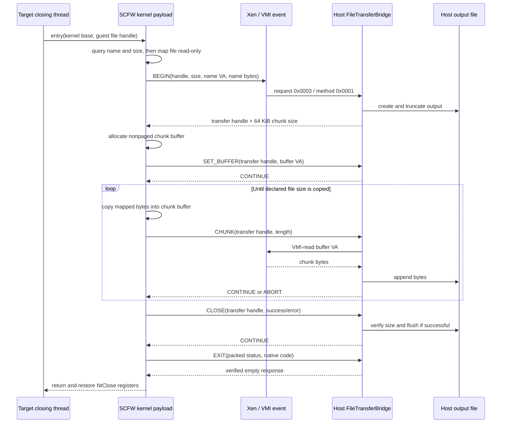

# File-transfer bridge

## Purpose

The file-transfer bridge copies files **written by the monitored deployed process** from the Windows guest to the host artifact directory.

It is not a standalone upload/download command. It is a subsystem of `deploy --monitor`:

1. kernel hooks notice a target-process file write;
2. the file is only marked at that point;
3. the target thread's later `NtClose` is paused;
4. a kernel-mode SCFW payload reads the completed file;
5. `FileTransferBridge` pulls 64 KiB chunks from guest memory into a host file;
6. the original `NtClose` resumes.

```mermaid
flowchart LR
    Write["Target calls NtWriteFile"] --> Mark["Host marks handle and file object"]
    Mark --> Close["Target calls NtClose"]
    Close --> Inject["Host injects kernel payload on closing thread"]
    Inject --> MapFile["Guest maps completed file"]
    MapFile --> Buffer["Guest fills 64 KiB buffer"]
    Buffer --> HostRead["Host reads buffer through VMI"]
    HostRead --> Output["Host artifact file"]
    HostRead --> Buffer
    Output --> Resume["Restore registers and resume NtClose"]
```



## Actors and responsibilities

| Actor | Responsibility |
|---|---|
| **Deploy monitor (host)** | Tracks processes and threads; hooks `NtWriteFile` and `NtClose`; decides which guest file handles belong to the target process. |
| **`FileTransfer` (host)** | Holds one marked handle/path/`_FILE_OBJECT`; owns the recipe executor after the transfer moves onto a closing thread. |
| **File-transfer recipe (host)** | Saves registers, allocates executable nonpaged guest memory, writes the embedded payload, and calls it with the kernel base and file handle. |
| **SCFW payload (guest kernel mode)** | Queries file metadata, maps the file, fills a shared chunk buffer, and drives the bridge methods. |
| **`FileTransferBridge` (host)** | Creates output files, allocates protocol handles, reads guest buffers through VMI, validates byte counts, and commits complete outputs. |

## Lifecycle: process-owned, then thread-owned

A marked file initially belongs to the tracked process because a Windows handle is process-local. Once `NtClose` starts, execution becomes synchronous on that specific thread, so ownership moves to the thread.



### 1. `NtWriteFile`: mark, do not copy

The breakpoint handler acts only when the current process is the child selected by the deploy monitor. It skips kernel handles, resolves the process-local handle to a `WindowsFileObject`, and records:

- the numeric handle;
- the `_FILE_OBJECT` address;
- the full guest path.

Repeated writes keep the handle marked. Deferring transfer until close means the guest payload sees the final file size and contents instead of a sequence of partial writes.

The hook runs at `NtWriteFile` entry and does not inspect the call's eventual `NTSTATUS`; a write attempt is enough to mark the handle.

### 2. `NtClose`: validate and attach to the closing thread

Before Windows closes a marked handle, the hook:

1. removes the pending transfer from the process map;
2. resolves the handle again;
3. discards it if the `_FILE_OBJECT` changed, protecting against handle reuse;
4. creates a `RecipeExecutor`;
5. stores the active transfer on the current tracked thread;
6. advances the first recipe step instead of allowing `NtClose` to run immediately.

If the hook is re-entered while that thread has an active transfer, it advances the existing recipe. Stack-pointer checks ignore nested calls, interrupts, or APC activity below the recipe's saved stack frame.

### 3. Recipe: run the payload in kernel context

The recipe preserves the original `NtClose` registers and performs:

```text
file_transfer_recipe(handle)
├─ ExAllocatePool(NonPagedPoolExecute, page-aligned payload size)
├─ VMI write(embedded file-transfer shellcode)
└─ shellcode_entry(kernel_image_base, process-local handle)
```

The kernel image base lets SCFW resolve imported kernel routines. Allocation or VMI-write failure jumps back to the first step after restoring the original registers, so the attempt is retried from a clean call frame.

When the payload returns, `RecipeExecutor` restores the exact registers captured at the original `NtClose`. The hook then releases the thread-owned `FileTransfer`, and Windows executes the close normally.

## Guest-to-host protocol

The payload uses bridge request `0x0003`. Every request carries `"VMIB"`; every accepted response contains the two verification stamps.



### Methods

| Method | Guest values | Host action | Response `value1` |
|---:|---|---|---|
| `BEGIN` `0x0001` | file handle, signed file size, UTF-16 name address, name byte length | Read the name, create output, allocate a 12-bit transfer handle | `(chunk_size << 12) | handle`; zero rejects |
| `SET_BUFFER` `0x0002` | transfer handle, guest buffer address | Associate the buffer VA with the session | `CONTINUE` or `ABORT` |
| `CHUNK` `0x0003` | transfer handle, valid byte count | VMI-read that many bytes and append | `CONTINUE` or `ABORT` |
| `CLOSE` `0x0004` | transfer handle, success/error | Remove session; exact-size check and flush on success | `CONTINUE` or `ABORT` |
| `EXIT` `0xffff` | packed terminal status, native code | Log payload completion; keep the deploy monitor running | verified response, no monitor completion |

The packed `BEGIN` response reserves its low 12 bits for a transfer handle (`1..4095`) and stores the negotiated chunk size above them.

## Where the bytes travel

File contents do **not** travel in bridge registers.

```text
Guest file
  └─ read-only mapped view
      └─ MmCopyMemory
          └─ guest nonpaged 64 KiB buffer
              └─ VMI read by host
                  └─ reusable host Vec<u8>
                      └─ host output file
```

Registers carry only the transfer handle, guest buffer address, and valid length. This keeps each hypercall fixed-size while allowing bounded bulk transfer.

## Host output and validation

For each accepted `BEGIN`, the bridge:

- creates the configured output directory if needed;
- flattens the guest path to its basename;
- replaces every non-ASCII-alphanumeric basename character with `_`;
- prefixes a monotonic, zero-padded output id with a minimum width of four digits, for example `0000-generated_bin`;
- truncates an existing file with the same generated path;
- rejects a chunk larger than 64 KiB or one that would exceed the declared size;
- commits only when received bytes exactly equal the declared size.

A failed/aborted session is removed, but an already-created partial host file is not deleted. Consumers should treat only a successful close as a committed transfer.

## Guest call graph

```text
entry(kernel_image_base, file_handle)
└─ TransferFile
   ├─ ZwQueryInformationFile(FileNameInformation)
   ├─ ZwQueryInformationFile(FileStandardInformation)
   ├─ ZwCreateSection(file)
   ├─ ZwMapViewOfSection(read-only)
   ├─ bridge.begin
   ├─ ExAllocatePoolWithTag(chunk size)
   ├─ bridge.set_buffer
   ├─ for each chunk
   │  ├─ MmCopyMemory(mapped view → shared buffer)
   │  └─ bridge.chunk
   ├─ bridge.close
   ├─ free buffer / unmap view / free filename
   └─ bridge.exit(terminal result)
```

## Host call graph

```text
Monitor::handle_event
├─ NtWriteFile hook
│  └─ Process::mark_file(FileTransfer::new)
├─ NtClose hook
│  ├─ Process::take_file
│  ├─ FileTransfer::start
│  └─ advance_file_transfer
│     └─ RecipeExecutor::execute
└─ Hypercall event
   └─ Bridge<(DeployBridge, FileTransferBridge)>::dispatch
      └─ FileTransferBridge::handle
         ├─ handle_begin
         ├─ handle_set_buffer
         ├─ handle_chunk
         ├─ handle_close
         └─ handle_exit
```

## Completion and important boundaries

- The transfer is synchronous with the intercepted close; the closing guest thread is occupied until the payload returns.
- Only files written through a handle observed by the target process are eligible. Existing files merely opened and closed are not copied.
- Empty files fail during section mapping (`STATUS_MAPPED_FILE_SIZE_ZERO`) and do not produce a successful transfer.
- Transfer-session handles are monotonic and not reused; after 4095 accepted transfers, later `BEGIN` requests are rejected.
- The successful shellcode allocation is not freed by the current recipe. This subsystem is intentionally proof-of-concept code, not a resident production agent.

See the [generic architecture](../README.md) for the register ABI and the [deploy workflow](../deploy/README.md) for how the monitor is installed before the child starts.
