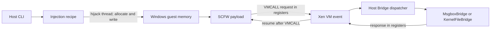

# Windows shellcode: the four execution modes

## The short version

`windows-shellcode` lets a Rust program on the **host** run a small `scfw` payload inside a Windows **guest** without installing a guest agent.

The host temporarily hijacks a guest thread to allocate, write and start the payload. The payload performs Windows work, then uses `VMCALL` as a synchronous request/response boundary. Xen turns that instruction into a VM event; the Rust bridge decodes the guest registers, runs the matching host handler, writes a response into the registers, and resumes the guest.



There is no socket, shared filesystem, or long-running service in the guest. Registers carry control messages; VMI reads and writes guest memory when a request needs bulk data.

For the composed flows built on top of these primitives - host-gated deployment, kernel hooks and bulk file transfer - see [`windows-bridge`](../windows-bridge/README.md).

## Vocabulary

| Name | Meaning here |
|---|---|
| **SCFW** | The C++ shellcode framework and the payloads built with it. It supplies position-independent startup and import resolution, self-cleanup, and the guest side of the bridge transport. |
| **Guest** | The Windows VM. The msgbox payload runs in user mode; the kernel-file payload runs in kernel mode. |
| **Host** | The Rust `windows-shellcode` process. It controls Xen through VMI, injects payloads, and handles bridge requests. |
| **Recipe** | A host-side sequence of guest calls and register changes. It advances only when the hijacked thread reaches the expected return point. |
| **Bridge** | The register protocol plus the Rust dispatcher and request-specific handler. `MsgboxBridge` and `KernelFileBridge` are handlers, not transports. |

## The four modes

| Subcommand | Recipe | Payload runs on | Recipe completes when | Payload |
|---|---|---|---|---|
| `user-call` | `user_shellcode_call_recipe` | the hijacked user-mode thread | the payload returns | msgbox |
| `user-spawn` | `user_shellcode_spawn_recipe` | a new guest thread | `CreateThread` returned | msgbox |
| `kernel-call` | `kernel_shellcode_call_recipe` | the hijacked thread, in kernel mode | the payload returns | kernel-file |
| `kernel-spawn` | `kernel_shellcode_spawn_recipe` | a spawned system thread | `PsCreateSystemThread` returned | kernel-file |

`call` and `spawn` describe *who runs the payload*, not asynchrony: neither recipe involves a Rust `Future`.

```bash
# User mode
VMI_XEN_DOMAIN=win10-22h2 cargo run --example windows-shellcode \
    --features arch-amd64,driver-xen,os-windows,utils -- user-spawn
VMI_XEN_DOMAIN=win10-22h2 cargo run --example windows-shellcode \
    --features arch-amd64,driver-xen,os-windows,utils -- user-call --title Hi --text There

# Kernel mode
VMI_XEN_DOMAIN=win10-22h2 cargo run --example windows-shellcode \
    --features arch-amd64,driver-xen,os-windows,utils -- kernel-spawn
VMI_XEN_DOMAIN=win10-22h2 cargo run --example windows-shellcode \
    --features arch-amd64,driver-xen,os-windows,utils -- kernel-call \
    --path 'C:\Users\John\Desktop\kernel-call.txt'
```

The payload binaries are built separately; see [`examples/shellcodes`](../shellcodes). `--path` accepts a DOS path, which receives the `\??\` object-manager prefix, or an NT path, which is passed through unchanged. Its default is a timestamped file on the `John` user's desktop.

## Lifecycle

### 1. Build-time: payload becomes part of the host binary

SCFW builds each x64 payload as a flat `.bin`. Rust embeds it with `include_bytes!`. No payload file is fetched at runtime.

### 2. Startup: establish Windows and Xen context

`main` opens the Xen domain selected by `VMI_XEN_DOMAIN`, pauses the VM briefly to find the Windows kernel, loads the matching kernel profile, and creates a `VmiSession`. The user-mode modes additionally resolve the carrier process, normally `explorer.exe`.

### 3. Injection: borrow a guest thread

`InjectorHandler<UserMode>` watches the target process until it finds a viable user-mode return point, then removes execute permission in a private Xen view so that the returning thread traps. `InjectorHandler<KernelMode>` instead breaks on `SeAccessCheck`, which is called constantly and always at `PASSIVE_LEVEL`. At that trap, the recipe owns the thread registers:

```text
user_shellcode_{call,spawn}_recipe
├─ VirtualAlloc(RWX, payload size)
├─ retry if allocation fails
├─ RtlFillMemory(payload bytes)        # materialize demand-zero pages
├─ VMI write(payload + parameters)
├─ on write failure: VirtualFree + retry
└─ call:  payload(parameter, 0)
   spawn: CreateThread(payload, parameter)
          ├─ on creation failure: VirtualFree + retry
          └─ CloseHandle(created thread handle)

kernel_shellcode_{call,spawn}_recipe
├─ ExAllocatePool(NonPagedPoolExecute, payload size)
├─ retry if allocation fails
├─ VMI write(payload + parameters)
├─ on write failure: ExFreePool + retry
└─ call:  payload(kernel_image_base, parameter)
   spawn: VMI write(entry thunk), PsCreateSystemThread(thunk)
          ├─ on creation failure: ExFreePool + retry
          └─ ZwClose(created thread handle)
```

Both recipes accept either an encoded `ShellcodeParameters` block by reference or a `ShellcodeParameterValue`. An encoded block is appended to the payload and its guest address becomes the parameter; a `ShellcodeParameterValue` appends no data and is passed through unchanged. The single parameter-source argument makes these modes mutually exclusive. Once the payload has been entered, the self-cleaning payload owns and releases its own allocation.

Before the first recipe step, an injector with a nonempty bridge enables hypercall monitoring, so a payload cannot lose its first `VMCALL` no matter which mode started it.

The kernel spawn recipe needs one extra step because `PsCreateSystemThread` passes a single `StartContext` argument while the payload expects two. A 32-byte thunk, reserved inside the payload's own allocation, loads the kernel image base and the parameter and jumps to the payload entry, so one payload binary serves both kernel modes.

### 4. Bridge exchange: route one register packet

The guest transport builds:

```text
magic = "VMIB"
request = handler id
method = operation within that handler
value1..value4 = operation-specific values
```

On x64 Xen, a request uses `RCX` for the magic, `RDX` for `request | method << 16`, and `R8`-`R11` for the four values. The host response uses `RAX`, `RBX`, `RCX`, and `RDX`.

For every handled hypercall, the host:

1. advances guest `RIP` past `VMCALL`;
2. decodes the registers into a `BridgePacket`;
3. matches `magic`, then `request`;
4. calls the handler selected by `request` and the operation selected by `method`;
5. stamps `"VMI-RS3!"` and `"VMI-RS4!"` into response slots 3 and 4;
6. writes the response registers and resumes the vCPU.

The SCFW client accepts a response only when both verification stamps match. A missing or unrelated host handler therefore looks like "no response," not a valid policy decision.

Request ids are allocated once across all examples:

| Request | Handler | Example | Methods |
|---:|---|---|---|
| `0x0001` | `MsgboxBridge` | windows-shellcode | terminal message box result |
| `0x0002` | `KernelFileBridge` | windows-shellcode | terminal kernel-file status |
| `0x0011` | `DeployBridge` | windows-bridge | download gate, execute gate, terminal status |
| `0x0012` | `FileTransferBridge` | windows-bridge | begin, set buffer, chunk, close, terminal status |

Handlers may return a typed completion result in addition to register values. The injector uses that result to end its event loop.

### 5. Terminal status

`MsgboxBridge` completes with the raw `MessageBoxA` result. `KernelFileBridge` completes with a compact status in `value1` and the native `NTSTATUS` in `value2`:

```text
value1 bits  0..7   stage
             8..15  stable status
            16..23  stage-specific error code
value2               NTSTATUS / HRESULT / native code
```

Stable statuses are success, waiting, invalid parameters, operation failed, and aborted. Keeping the stage separate answers both "what failed?" and "how did it fail?" The kernel-file stages are `create` and `write`.

## Choosing a mode

Completion ordering differs, and it is observable in the log:

- **call** - the payload's terminal `VMCALL` arrives while the recipe is still executing. The injector stores that result, resumes the guest so the payload can free itself and return, and only completes after the recipe has finished and monitoring has been torn down. Expect `shellcode completed` *before* `recipe: finished`.
- **spawn** - the recipe finishes as soon as the thread exists, so teardown happens first and the payload's `VMCALL` is handled afterwards. Expect `recipe: finished` *before* `shellcode completed`.

Two hazards are inherent to the call modes, not defects:

- `user-call` runs the modal `MessageBoxA` on a hijacked `explorer.exe` thread, so parts of the shell stay unresponsive until the box is dismissed.
- `kernel-call` re-enters the file-system stack on a thread stopped at `SeAccessCheck`, which is itself frequently reached from inside the object manager and the I/O path. If that thread already holds file-system or object-manager resources, the guest can deadlock. `kernel-spawn` does its I/O on a fresh System thread with no inherited locks, so prefer it when either would do.

`kernel-spawn` also changes process context: the payload runs in the System process. A parameter that resolves into the payload's own allocation stays valid, while a process-relative parameter such as a handle or a user-mode address does not. The kernel-file payload therefore uses a kernel handle (`OBJ_KERNEL_HANDLE`) and an absolute NT path.

## Call graph

```text
main
├─ run_msgbox
│  ├─ msgbox_call_recipe / msgbox_spawn_recipe
│  └─ MsgboxBridge::handle
└─ run_kernel_file
   ├─ kernel_file_call_recipe / kernel_file_spawn_recipe
   └─ KernelFileBridge::handle
```

Inside the guest:

```text
msgbox entry(parameters, _)          kernel-file entry(kernel base, parameters)
└─ MessageBoxA                       └─ ZwCreateFile(FILE_OVERWRITE_IF)
   └─ bridge.exit(result)               ├─ ZwWriteFile("hello world")
                                        ├─ ZwClose
                                        └─ bridge.exit(status)
```
